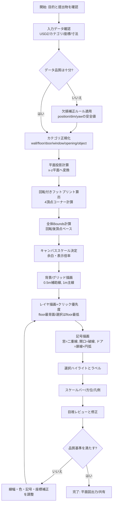

# Floorplan Flowchart

最終更新: 2026-05-19

```mermaid
flowchart TD
    A[開始: 目的と提出物を確認] --> B[入力データ確認<br/>USDZ/カテゴリ/座標/寸法]
    B --> C{データ品質は十分?}
    C -- いいえ --> C1[欠損補正ルール適用<br/>position/dim/yawの安全値]
    C1 --> D
    C -- はい --> D[カテゴリ正規化<br/>wall/floor/door/window/opening/object]

    D --> E[平面投影計算<br/>x-z平面へ変換]
    E --> F[回転付きフットプリント算出<br/>4頂点コーナー計算]
    F --> G[全体Bounds計算<br/>回転後頂点ベース]

    G --> H[キャンバススケール決定<br/>余白・表示倍率]
    H --> I[背景/グリッド描画<br/>0.5m補助線, 1m主線]
    I --> J[レイヤ描画+クリック優先度<br/>floor最背面/選択はfloor最低]
    J --> K[記号描画<br/>窓=二重線, 開口=破線, ドア=扉線+円弧]
    K --> L[選択ハイライトとラベル]
    L --> M[スケールバー/方位/凡例]
    M --> N[目視レビューと修正]
    N --> O{品質基準を満たす?}
    O -- いいえ --> P[線幅・色・記号・座標補正を調整]
    P --> J
    O -- はい --> Q[完了: 平面図出力/共有]
```

